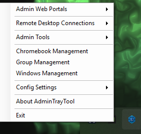
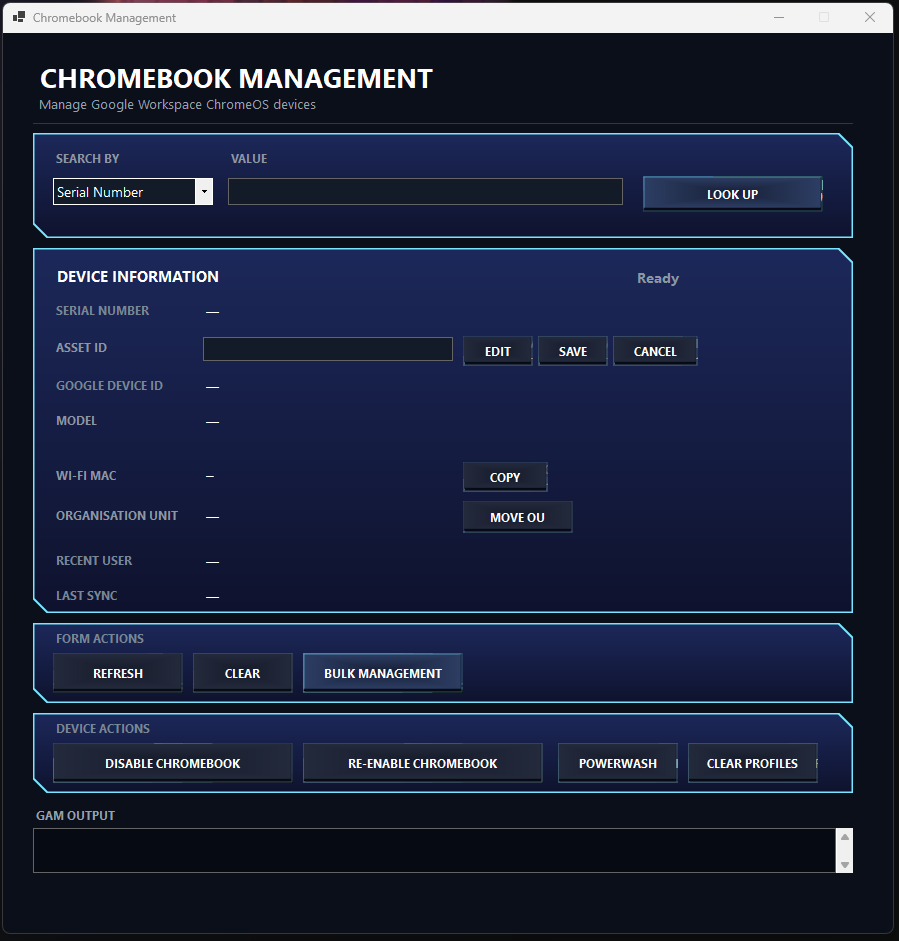
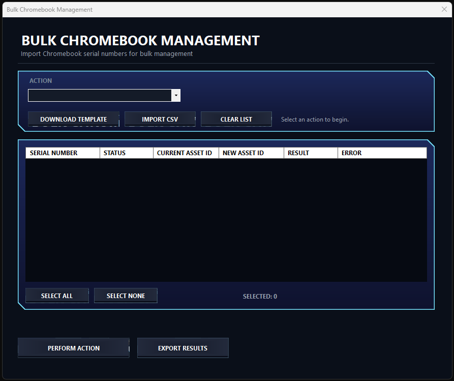
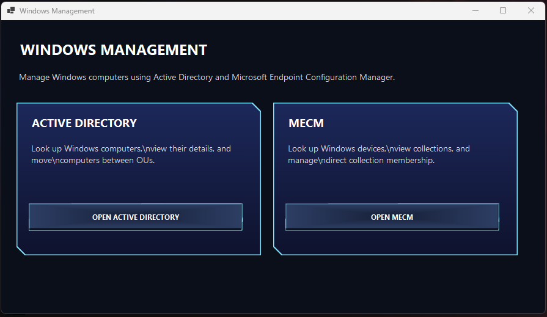

# AdminTrayTool

**A Windows system-tray toolkit for IT administrators.**

AdminTrayTool brings common administration tasks into one lightweight Windows application, providing quick access to **Chromebook, Google Workspace, Active Directory, MECM/SCCM, Remote Desktop, PowerShell, and other IT administration tools**.

Designed for IT administrators who need frequently used tools and management tasks available from a single place.

[**⬇️ Download AdminTrayTool**](https://github.com/nitheraz/AdminTrayTool/releases/latest) · [**📖 Documentation**](https://nitheraz.github.io/AdminTrayTool/)


> **AdminTrayTool is designed to complement existing IT service-management platforms rather than replace them.**

## Why AdminTrayTool?

IT administrators often switch between multiple management consoles, web portals, remote connections, scripts, and command-line tools throughout the day.

AdminTrayTool provides a single system-tray interface for launching and performing many of these common tasks.

**One application. Multiple administration tools.**

## Features

### 🖥️ Windows Management

Manage Windows computers through:

* Active Directory Management
* MECM / SCCM Management
* Computer lookup
* OU searching
* Moving computers between organisational units
* MECM collection membership management

### 💻 Chromebook Management

Manage individual Google Workspace Chromebooks using GAM7.

Features include:

* Search by Serial Number or Asset ID
* View Chromebook information
* View current Asset ID
* Update Asset ID
* Disable Chromebook
* Re-enable Chromebook
* Move Chromebook between organisational units
* Clear Profiles
* Powerwash Chromebook

### 📋 Bulk Chromebook Management

Perform Chromebook operations against multiple devices using CSV files.

Supported actions include:

* Disable Chromebook
* Re-enable Chromebook
* Move to OU
* Powerwash
* Clear Profiles
* Update Asset ID

The bulk workflow is:

**Select Action → Import CSV → Select Devices → Review → Execute → Export Results**

Device checking is optional, allowing valid imported CSV files to be executed without first checking every device against Google Workspace.

### 👥 Google Group Management

Use GAM7 to add staff members to Google Workspace Groups.

Group templates can be configured for common staff roles, allowing multiple groups to be managed from a single operation.

### 🚀 Quick Launch

Configure shortcuts for commonly used administration resources:

* Administration web portals
* Remote Desktop connections
* Local administration tools
* PuTTY
* PowerShell

### ⚙️ Configuration

AdminTrayTool includes an in-app configuration editor for:

* Administration web portals
* Remote Desktop connections
* Local administration tools
* Google Group templates

Application configuration is stored outside the installation directory so normal application upgrades do not replace it.

## Screenshots

### Main Menu

AdminTrayTool runs from the Windows system tray, providing quick access
to commonly used IT administration tools.



### Chromebook Management

Manage individual Google Workspace Chromebooks using GAM7.



### Bulk Chromebook Management

Perform Chromebook administration tasks against multiple devices using CSV files.



### Windows Management

Access Active Directory and MECM/SCCM management tools from one interface.



## Download

### Windows 10 / Windows 11

Download the latest release:

[**Download AdminTrayTool**](https://github.com/nitheraz/AdminTrayTool/releases/latest)

The release includes:

* **MSI installer** — recommended for normal installation
* **Portable ZIP** — for users who prefer a portable installation

AdminTrayTool supports **in-place upgrades**, so you can normally install a newer MSI over the existing installation without uninstalling the previous version.

## Requirements

* Windows 10 or Windows 11
* Appropriate Windows permissions for the administration features being used
* Network access to the relevant management services
* GAM7 for Google Workspace features

GAM7 is bundled with the AdminTrayTool installer.

Google Workspace features require an appropriately configured GAM7 project and an authorized Google Workspace account.

## Installation

Download the latest installer from the [GitHub Releases page](https://github.com/nitheraz/AdminTrayTool/releases/latest).

Run `AdminTrayTool.msi` and follow the installation prompts.

After installation, launch AdminTrayTool from the Start Menu and look for the application icon in the Windows system tray.

## GAM7 Setup

AdminTrayTool uses GAM7 for Google Workspace operations.

The first time you use a GAM7-powered feature, AdminTrayTool checks whether GAM7 is available and configured.

If GAM7 requires authentication, the OAuth process will guide you through signing in with your Google Workspace administrator account.

See the full [GAM7 Setup & Troubleshooting guide](docs/gam-setup.md).

## Documentation

Full documentation is available through the project's documentation site.

Useful guides include:

* [Getting Started](docs/getting-started.md)
* [Chromebook Management](docs/guides/chromebook-management.md)
* [Bulk Chromebook Management](docs/guides/bulk-chromebook-management.md)
* [Windows Management](docs/guides/windows-management.md)
* [Active Directory Management](docs/guides/active-directory-management.md)
* [MECM / SCCM Management](docs/guides/mecm-management.md)
* [Group Management](docs/guides/group-management.md)
* [Config Settings](docs/guides/config-settings.md)
* [Frequently Asked Questions](docs/faq.md)

## Configuration Location

AdminTrayTool stores its application configuration in:

```text
%ProgramData%\AdminTrayTool\
```

The main configuration files are:

```text
config.json
groupTemplates.json
```

GAM7 maintains its own configuration separately under:

```text
%USERPROFILE%\.gam\
```

## Updating

AdminTrayTool supports in-place upgrades.

When a new version is released, install the newer MSI over the existing installation. You do not normally need to uninstall the previous version first.

Application configuration stored under `%ProgramData%\AdminTrayTool\` is preserved during normal upgrades.

GAM7 authentication is maintained separately under the user's Windows profile.

## Security

AdminTrayTool is intended for IT administrators who already have the appropriate permissions to perform the requested operations.

The application does not grant additional Windows, Active Directory, MECM, or Google Workspace permissions.

Sensitive GAM7 authentication information should not be committed to source control or copied between users simply to avoid authentication.

In particular, do not commit `client_secrets.json` or OAuth tokens to the repository.

## Installer Development

The [`installer`](installer/) directory contains the WiX installer project used to build the AdminTrayTool MSI.

See [`installer/README.md`](installer/README.md) for local MSI build instructions and installer development notes.

## License

See the repository for licensing information.
